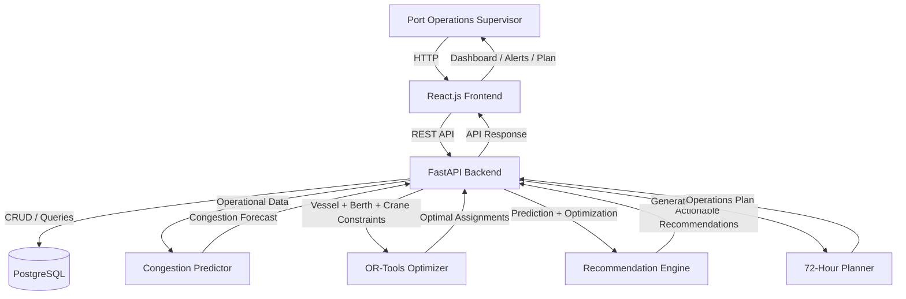

# Architecture

## System Architecture

[Describe the overall architecture of your system. Replace the Mermaid diagram below with your actual architecture.]

## Components

| Component | Technology | Responsibility |
|---|---|---|
| Frontend | React 18, Vite, TailwindCSS | Dashboard UI, data visualization, and user interaction |
| Backend API | FastAPI | Business logic, request orchestration, and data validation |
| AI / Predictor | Rule-Based Engine (Future: ML) | Congestion scoring, risk level classification |
| Optimizer | Google OR-Tools | Berth allocation and operations scheduling |
| Database | PostgreSQL & SQLAlchemy | Storing vessels, schedules, ports, and predictions |

## Data Flow

Data moves through the system in the following sequence:

1. The Operations Supervisor submits or views vessel schedules via the React dashboard.
2. The FastAPI backend processes the REST API requests, validating data using Pydantic schemas.
3. The Congestion Predictor extracts live operational features from PostgreSQL to generate congestion scores and risk levels.
4. The OR-Tools Optimizer evaluates berth availability and vessel constraints to produce an optimal operations plan.
5. The Recommendation Engine generates actionable insights (e.g., priority adjustments or rerouting), which are displayed in the dashboard.

## Security Considerations

The following security measures have been implemented:

- **JWT Authentication:** All API routes are protected and require a valid Bearer token.
- **Environment Variables:** Sensitive information (database URLs, secret keys) is stored in `.env` files and excluded from version control.
- **Role-Based Access Control:** Distinct roles (ADMIN, PORT_MANAGER, SHIFT_SUPERVISOR) restrict operations like modifying schedules.
- **Password Hashing:** User passwords are securely hashed using bcrypt prior to database storage.

## Scalability Notes

Considerations for scaling beyond the hackathon prototype:

- **Stateless Backend:** The FastAPI application is stateless and can be horizontally scaled behind a load balancer to handle increased traffic.
- **Asynchronous Processing:** Heavy operations such as OR-Tools optimization and future ML inference could be offloaded to asynchronous background workers (e.g., Celery/Redis).
- **Database Scaling:** PostgreSQL can comfortably handle current volumes, but read-replicas could be introduced to support read-heavy analytical dashboards.
- **ML Integration:** The current rule-based prediction engine is designed to be easily swapped with an advanced ML model (like XGBoost or a watsonx.ai endpoint) as data volume grows.
